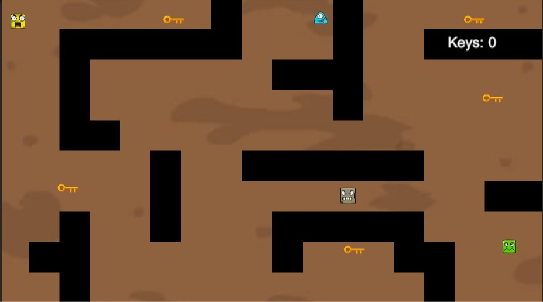

# Maze-Game-of-Tun
Tớ làm một con mazegame đơn giản thôi nhưng mà cũng khó chơi phết đó 🐵, tớ đã sử dụng thuật toán tìm đường cho các enemy để chúng có thể tìm đường đến player và tớ cũng đang trong quá trình phát triển nó sao cho game được hay hơn, mong mọi người đóng góp ý tưởng nhiệt tình để mình có tinh thần phát triển mạnh mẽ hơn nha

